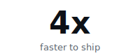
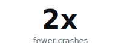
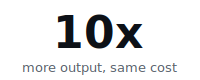
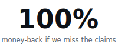

<div align="center">


# Off Grid

### The Swiss Army Knife of On-Device AI

**Chat. Generate images. Use tools. See. Listen. All on your phone or Mac. All offline. Zero data leaves your device.**

[](https://github.com/alichherawalla/off-grid-mobile)
[](LICENSE)
[](https://play.google.com/store/apps/details?id=ai.offgridmobile)
[](https://apps.apple.com/us/app/off-grid-local-ai/id6759299882)
[](#install)
[](https://codecov.io/gh/alichherawalla/off-grid-mobile)
[](https://join.slack.com/t/off-grid-mobile/shared_invite/zt-3q7kj5gr6-rVzx5gl5LKPQh4mUE2CCvA)

</div>

---

<div align="center">

<sub><b>BUILT BY</b></sub>

<a href="https://mobile.wednesday.is/"></a>

</div>

Off Grid is built by [**Wednesday Solutions**](https://mobile.wednesday.is/). We run **AI-Native Mobile Squads**: pre-vetted iOS and Android engineers paired with AI tooling for code review, testing, screenshot regression, and release notes. Squads plug into your org in a week and ship to production from day one.

<table align="center">
  <tr>
    <td></td>
    <td></td>
    <td></td>
    <td></td>
  </tr>
</table>

<p align="center"><b>Want the same team that shipped offline AI to a phone working on your product?</b></p>

<p align="center">
<a href="https://mobile.wednesday.is/hire-ai-native-mobile-squad"></a>
</p>

---

## Not just another chat app

Most "local LLM" apps give you a text chatbot and call it a day. Off Grid is a **complete offline AI suite** — text generation, image generation, vision AI, voice transcription, tool calling, and document analysis, all running natively on your phone's or Mac's hardware.

---

## What can it do?

<div align="center">
<table>
  <tr>
    <td align="center"><br /><b>Onboarding</b></td>
    <td align="center"><br /><b>Text Generation</b></td>
    <td align="center"><br /><b>Image Generation</b></td>
  </tr>
  <tr>
    <td align="center"><br /><b>Vision AI</b></td>
    <td align="center"><br /><b>Attachments</b></td>
    <td align="center"><br /><b>Tool Calling</b></td>
</tr>
</table>
</div>

**Text Generation** — Run Qwen 3, Llama 3.2, Gemma 3, Phi-4, and any GGUF model. Streaming responses, thinking mode, markdown rendering, 15-30 tok/s on flagship devices. Bring your own `.gguf` files too.

**Remote LLM Servers** — Connect to any OpenAI-compatible server on your local network (Ollama, LM Studio, LocalAI). Discover models automatically, stream responses via SSE, store API keys securely in the system keychain. Switch seamlessly between local and remote models.

**Tool Calling** — Models that support function calling can use built-in tools: web search, calculator, date/time, device info, and knowledge base search. Automatic tool loop with runaway prevention. Clickable links in search results.

**Project Knowledge Base** — Upload PDFs and text documents to a project's knowledge base. Documents are chunked, embedded on-device with a bundled MiniLM model, and retrieved via cosine similarity — all stored locally in SQLite. The `search_knowledge_base` tool is automatically available in project conversations.

**Image Generation** — On-device Stable Diffusion with real-time preview. NPU-accelerated on Snapdragon (5-10s per image), Core ML on iOS. 20+ models including Absolute Reality, DreamShaper, Anything V5.

**Vision AI** — Point your camera at anything and ask questions. SmolVLM, Qwen3-VL, Gemma 3n — analyze documents, describe scenes, read receipts. ~7s on flagship devices.

**Voice Input** — On-device Whisper speech-to-text. Hold to record, auto-transcribe. No audio ever leaves your phone.

**Document Analysis** — Attach PDFs, code files, CSVs, and more to your conversations. Native PDF text extraction on both platforms.

**AI Prompt Enhancement** — Simple prompt in, detailed Stable Diffusion prompt out. Your text model automatically enhances image generation prompts.

---

<br />

<div align="center">

<sub>**FOUNDING SUPPORTER PRE-ORDERS · NOW OPEN**</sub>

# Off Grid Pro

**First 100 supporters lock in lifetime access for $10.**

</div>

<br />

The free OSS keeps shipping, MIT, forever — that's not changing. Pro is an optional, additive tier we're opening pre-orders for.

This is our little hope of keeping ambient AI on-device alive — and sustaining the open-source release that this project has been built on for the last two years. Not a subscription. Not VC. A small, finite group of people willing to fund the next 12 weeks of full-time work.

**$10 × 100 = $1,000. After that, lifetime Pro moves to $50.**

### What Pro adds

- **Custom personas** — system prompts, voice, persistent memory per assistant
- **End-to-end voice mode** — Whisper STT (already shipping) + Kokoro TTS, all on-device
- **Calendar + email + MCP servers** — Linear, Notion, GitHub, your own MCP. Drafts only; you approve every send.
- **Larger models** — full size range, including 7B on flagship phones, 13B on iPads / M-series Macs
- **Future Pro features** — included for the supported lifetime of the app

### The promise

Pro ships in **12 weeks** from your purchase, or full refund. No forms, no questions.

### Claim a Founding Supporter spot

Join the founders Slack and drop into **#pro-first-100**. We'll say hi and get you set up.

**[→ Join the Slack](https://join.slack.com/t/off-grid-mobile/shared_invite/zt-3q7kj5gr6-rVzx5gl5LKPQh4mUE2CCvA)**

## Performance

| Task | Flagship | Mid-range |
|------|----------|-----------|
| Text generation | 15-30 tok/s | 5-15 tok/s |
| Image gen (NPU) | 5-10s | — |
| Image gen (CPU) | ~15s | ~30s |
| Vision inference | ~7s | ~15s |
| Voice transcription | Real-time | Real-time |

Tested on Snapdragon 8 Gen 2/3, Apple A17 Pro. Results vary by model size and quantization.

---

<a name="install"></a>
## Install

<div align="center">
<table><tr>
<td align="center"><a href="https://apps.apple.com/us/app/off-grid-local-ai/id6759299882"></a></td>
<td align="center"><a href="https://play.google.com/store/apps/details?id=ai.offgridmobile"></a></td>
</tr></table>
</div>

Or grab the latest APK from [**GitHub Releases**](https://github.com/alichherawalla/off-grid-mobile/releases/latest).

> **macOS**: The iOS App Store version runs natively on Apple Silicon Macs via Mac Catalyst / iPad compatibility.

### Build from source

```bash
git clone https://github.com/alichherawalla/off-grid-mobile.git
cd off-grid-mobile
npm install

# Android
cd android && ./gradlew clean && cd ..
npm run android

# iOS
cd ios && pod install && cd ..
npm run ios
```

> Requires Node.js 20+, JDK 17 / Android SDK 36 (Android), Xcode 15+ (iOS). See [full build guide](docs/ARCHITECTURE.md#building-from-source).

---

## Testing

[](https://github.com/alichherawalla/off-grid-mobile/actions/workflows/ci.yml)
[](https://codecov.io/gh/alichherawalla/off-grid-mobile)

Tests run across three platforms on every PR:

| Platform | Framework | What's covered |
|----------|-----------|----------------|
| React Native | Jest + RNTL | Stores, services, components, screens, contracts |
| Android | JUnit | LocalDream, DownloadManager, BroadcastReceiver |
| iOS | XCTest | PDFExtractor, CoreMLDiffusion, DownloadManager |
| E2E | Maestro | Critical path flows (launch, chat, models, downloads) |

```bash
npm test              # Run all tests (Jest + Android + iOS)
npm run test:e2e      # Run Maestro E2E flows (requires running app)
```

This project is tested with BrowserStack.

---

## Documentation

| Document | Description |
|----------|-------------|
| [Architecture & Technical Reference](docs/ARCHITECTURE.md) | System architecture, design patterns, native modules, performance tuning |
| [Codebase Guide](docs/standards/CODEBASE_GUIDE.md) | Comprehensive code walkthrough |
| [Design System](docs/design/DESIGN_PHILOSOPHY_SYSTEM.md) | Brutalist design philosophy, theme system, tokens |
| [Visual Hierarchy Standard](docs/design/VISUAL_HIERARCHY_STANDARD.md) | Visual hierarchy and layout standards |

---

## Community

Join the conversation on [**Slack**](https://join.slack.com/t/off-grid-mobile/shared_invite/zt-3q7kj5gr6-rVzx5gl5LKPQh4mUE2CCvA) — ask questions, share feedback, and connect with other Off Grid users and contributors.

---

## Contributing

Contributions welcome! Fork, branch, PR. See [development guidelines](docs/ARCHITECTURE.md#contributing) for code style and the [codebase guide](docs/standards/CODEBASE_GUIDE.md) for patterns.

---

## Acknowledgments

Built on the shoulders of giants:
[llama.cpp](https://github.com/ggerganov/llama.cpp) | [whisper.cpp](https://github.com/ggerganov/whisper.cpp) | [llama.rn](https://github.com/mybigday/llama.rn) | [whisper.rn](https://github.com/mybigday/whisper.rn) | [local-dream](https://github.com/xororz/local-dream) | [ml-stable-diffusion](https://github.com/apple/ml-stable-diffusion) | [MNN](https://github.com/alibaba/MNN) | [Hugging Face](https://huggingface.co)

---


## Star History

[](https://www.star-history.com/#alichherawalla/off-grid-mobile&type=date&legend=top-left)

<div align="center">

**Off Grid** — Your AI, your device, your data.

*No cloud. No data harvesting. Just AI that works anywhere.*

[Join the Community on Slack](https://join.slack.com/t/off-grid-mobile/shared_invite/zt-3q7kj5gr6-rVzx5gl5LKPQh4mUE2CCvA)

</div>
